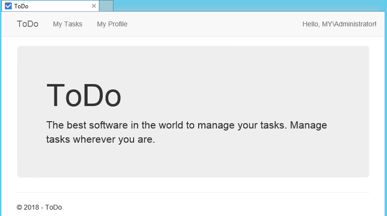

# ToDoApp
The goal of this project is to demonstrate how basic on-premise application can be migrated to Microsoft Azure Platform-as-a-Service (PaaS) services. 
## Solution contents
* ContosoToDo - Web UI for task management
* ToDoCleanUp - Console app for cleaning up completed tasks
* ToDoNotifications - Console app for sending emails to users with expired tasks
## Installation instructions (on-premise)
### Prerequisites
* Windows Server 2012 R2 (Domain joined), for lab demonstration purposes, nothing should be installed it
### Server configuration
* Install .Net Framework 4.6.2
* Add Web Server (IIS) role
  * "SMTP Server" feature, if doesnt exist already
  * ".NET Framework 4.5 Features/ASP.NET 4.5" feature
  * "Windows Authentication" Role Services
  * "Application Development/ASP.NET 4.5" Role Services
* Install SQL Server Express Edition
 * Download from https://www.microsoft.com/en-us/sql-server/sql-server-downloads
 * Make sure "Database Engine Services" is installed
 * Enable Mixed Mode Authentication
 * Use "Default instance"
* Install SQL Server Management Studio
 * Download from https://docs.microsoft.com/en-us/sql/ssms/download-sql-server-management-studio-ssms?view=sql-server-2017
### Installing solution components
#### Database
1. Connect to SQL Server with SQL Management Studio (SSMS)
2. Create new blank database called "ToDoDB"
3. Right click on database and under 'Tasks' choose 'Upgrade Data-tier Application...'
4. Select provided 'ToDoDB.dacpac' file and complete the upgrade wizard
5. Using SSMS create new login on the server
  * select SQL Server Authentication
  * specify login name - todosql
  * specify pass - TodoPassword1!
  * for this lab purposes remove checkboxes related to password policies
  * select default database 'ToDoDB'
  * under 'User Mapping' select ToDODB database and select 'db_owner' role for it
#### Web Application
1. Open C:\inetpub\wwwroot folder and delete files there
2. Copy over all files of the website to C:\inetpub\wwwroot
3. Open 'IIS Manager' console and in 'Default Web Site' 'Authentication' configuration disable 'Anonymous Authentication' and enable 'Windows Authentication'
4. Open C:\inetpub\wwwroot\web.config file and under <configuration><connectionStrings> modify 'ToDoItemContext' entry by changing its connection string to "Data Source=localhost;Initial Catalog=ToDoDB;User Id=todosql;Password=TodoPassword1!;", replace values to yours if you didn't follow this guide
5. Open Internet Explorer or any other browser and navigate to http://localhost/, try checking 'My Tasks' and 'My Profile' areas to verify that there are no issues with SQL database connection

#### SMTP server configuration (optional)
1. Open 'IIS 6.0 Manager' console, not the 'IIS Manager'
2. Right click on SMTP server and start it, if its not started
3. Under SMTP server properties, on 'General' tab, choose assigned IP. On 'Access' tab, click 'Relay' button and add two IP addresses, one 127.0.0.1 and the one you selected on 'General' tab. Close SMTP server properties.
#### Notification service
1. Create folder on a server f.e. c:\todo\notifications
2. Copy over published files of ToDoNotifications console app
3. Open "C:\todo\notifications\ToDoNotifications.exe.config" file and edit its connection string to the same as used in Web Application, update SMTP server setting, with your server name.
4. Create a scheduled task that runs 'ToDoNotifications.exe' executable on regular basis.
5. To test service, open ToDo Web Application, update your profile with proper email and enable email notifications. Create a task that is not completed and that has an expired deadline. Run "ToDoNotifications.exe" (without scheduled task), make sure it says 'Completed' without any errors. Check your email if you have received an email (might be in Spam folder)
#### CleanUp service
1. Create folder on a server f.e. c:\todo\cleanup
2. Copy over published powershell file
3. Update $connectionString variable in the PowerShell script file with connection string that was used with the Web Application
3. Create a scheduled task that runs 'ToDoCleanUp.ps1' script on regular basis.
4. To test the script, create new or update any task by setting 'Completed' flag on it. When PowerShell script is executed it deletes all tasks that are completed.
## Migrating components to Azure
The following steps describe how to transform and migrate this simple ToDo application to Microsoft Azure. Migration paths:
 * Web Application -> WebApp in Azure App Service
 * Windows Authentication -> App Service Authentication
 * Database -> Azure SQL Database
 * ToDoNotifications -> WebJob in Azure App Service
 * ToDoCleanUp -> Azure Function
 * SMTP Server -> SendGrid for Microsoft Azure (3rd party)
### Database
One of the easiest and quickest way to migrate on-premise SQL database to Azure is by exporting Data-tier Application '*.bacpac' file and importing it into Azure SQL server. This can also be done by using simplified 'Deploy Database to Microsoft Azure SQL Database' wizard in SQL Management Studio.  
